[](https://www.python.org/downloads/release/python-360/)


[](https://github.com/shyam999/django-ecommerce/blob/master/LICENSE)
# E-commerce Website
Django-ecommerce is an open-source ecommerce platform built on the Django Web Framework.
## Features Included
- Custom Admin dashboard
- Search Functionality
- Shopping Cart
- Order Management
- Coupon system
- Responsive, mobile-friendly design
- Much more...

- Virtual Chat Bot :- 
This project includes a virtual chat bot that has the capability to listen to voice input and respond to text input. It adds an interactive and dynamic element to your Django e-commerce platform. Users can communicate with the chat bot to perform various tasks or obtain information about products and services.

## Installation

**1.clone Repository & Install Packages**
```sh
git clone https://github.com/Mdwaseel/omni-mart
pip install -r requirements.txt
```
**2.Setup Virtualenv**
```sh
virtualenv env
source env/bin/activate
```
**3.Migrate & Start Server**
```sh
python manage.py makemigrations
python manage.py migrate
python manage.py runserver
```

# Demo :- 

## User Interface

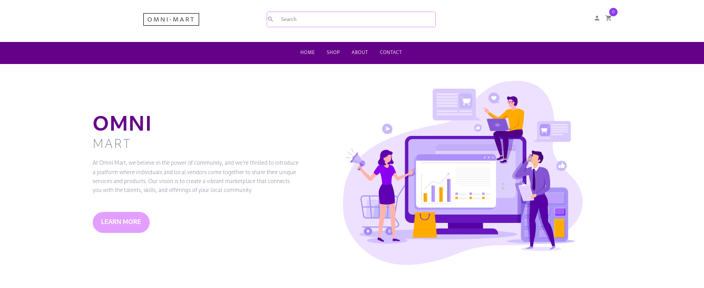

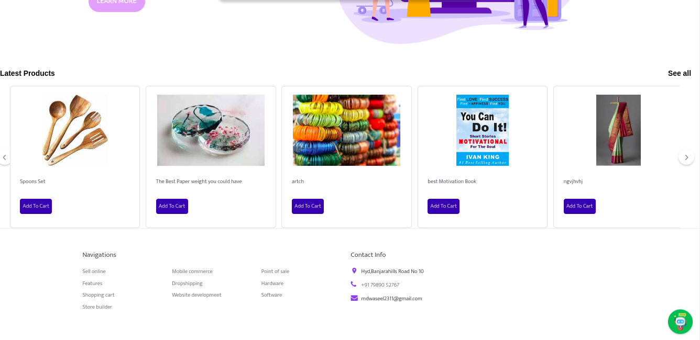

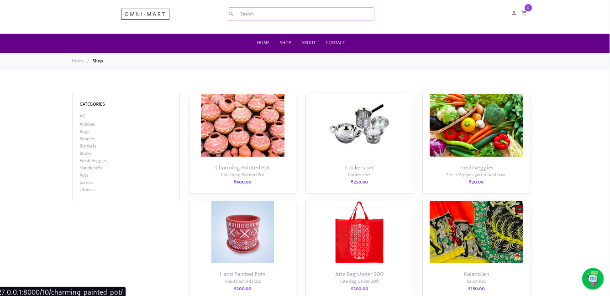

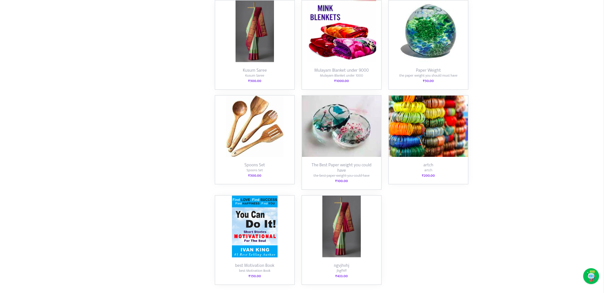

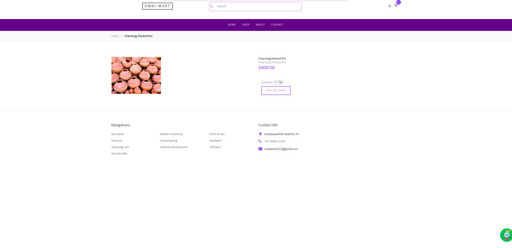

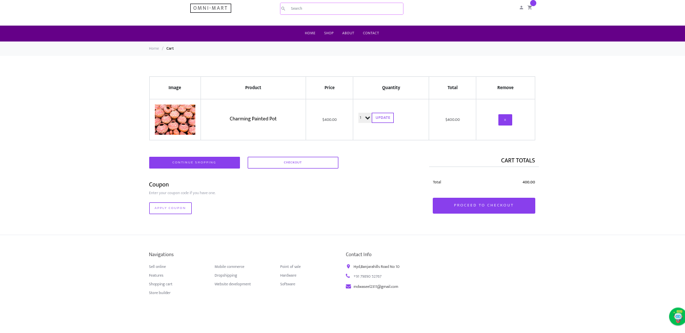

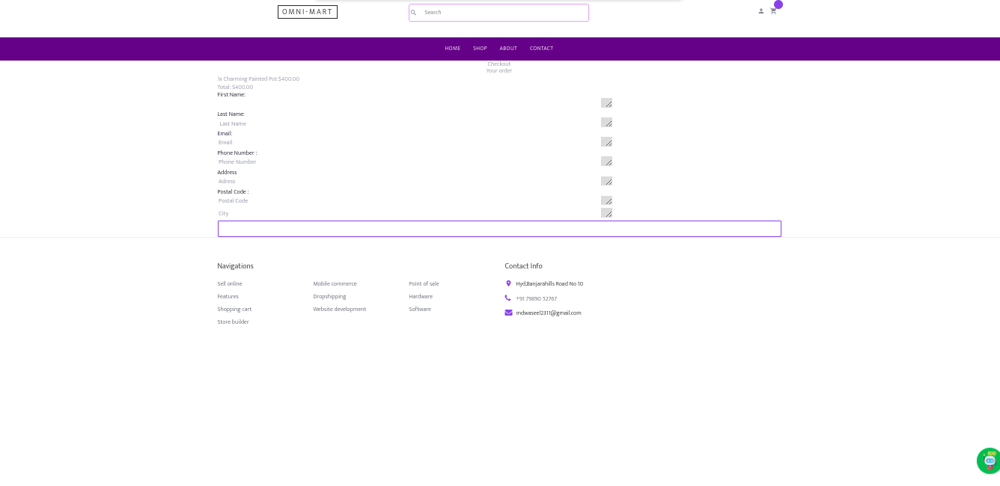

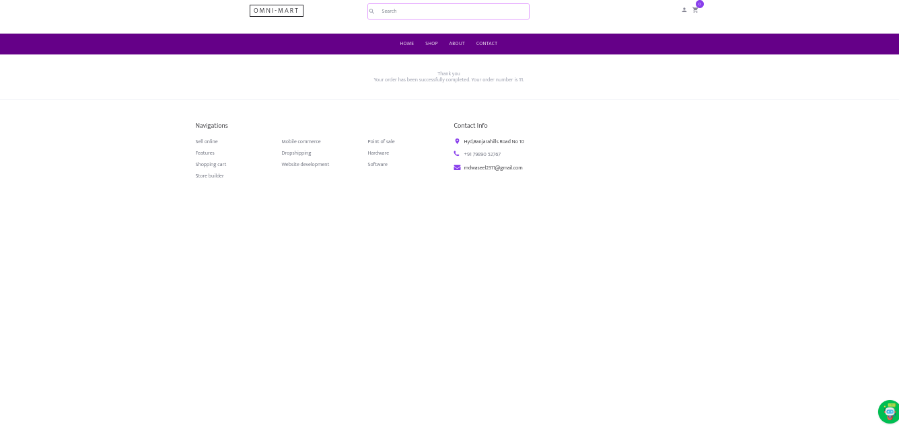


## Admin Interface


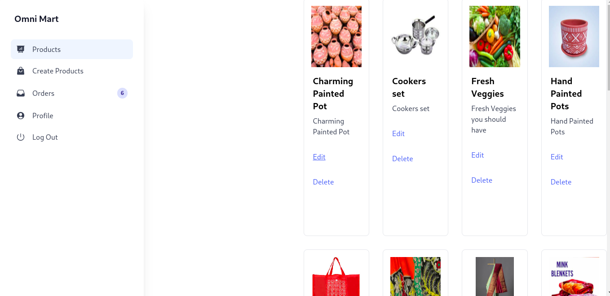

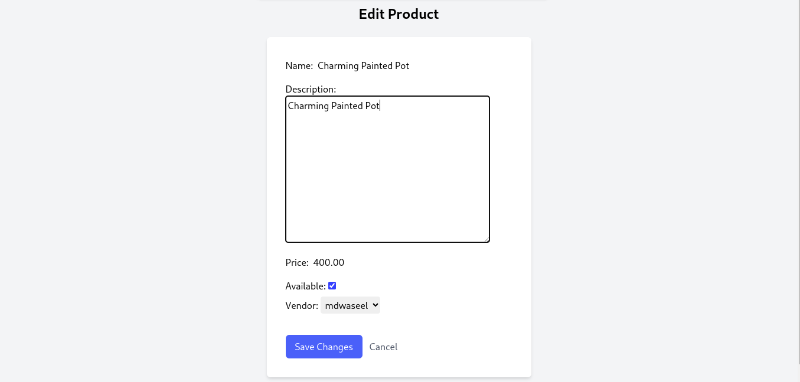

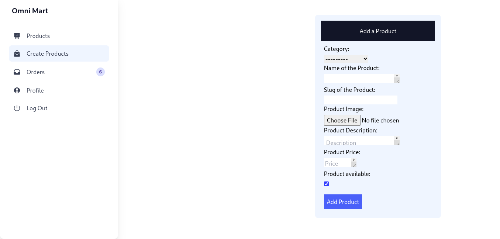

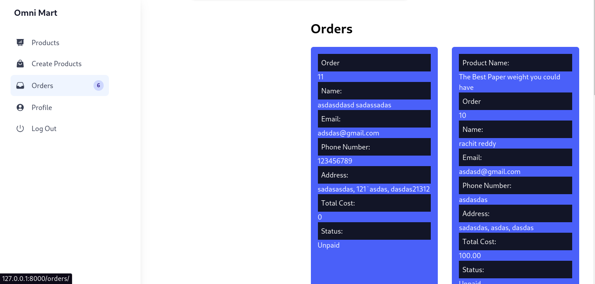

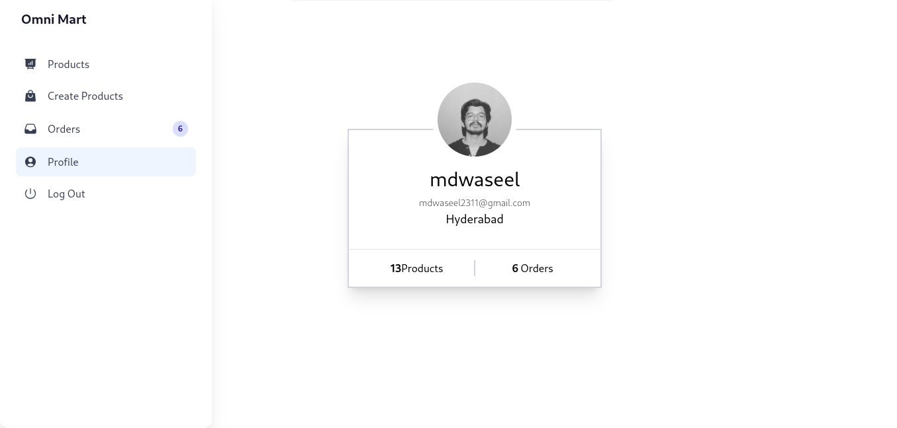

## Virtual Chat-Bot


